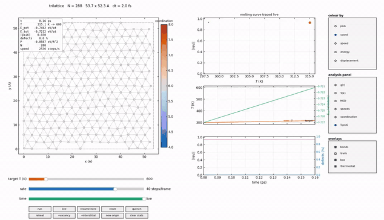
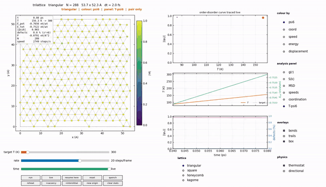
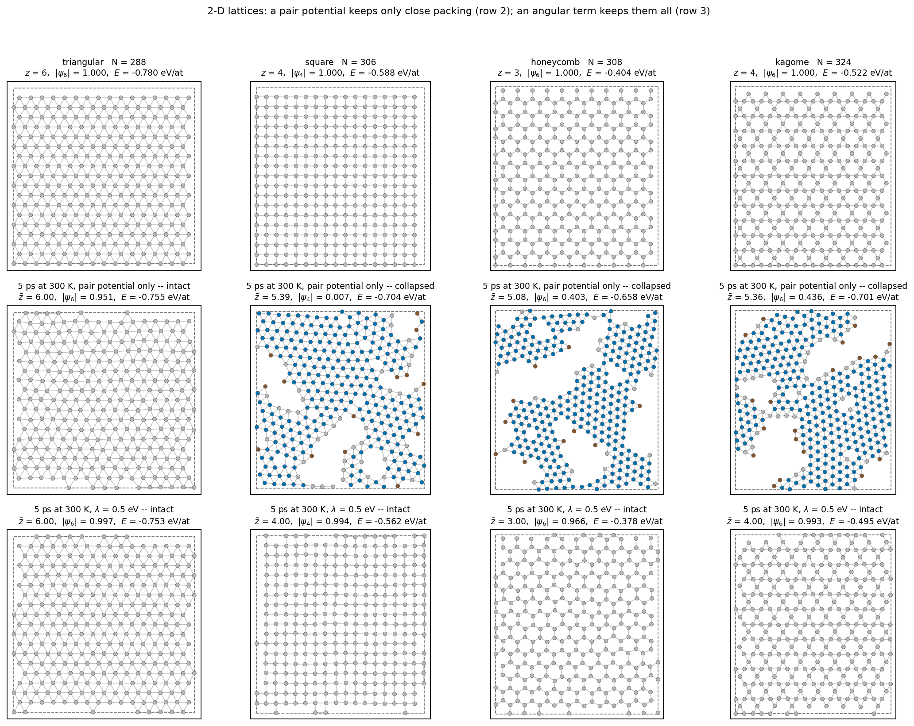
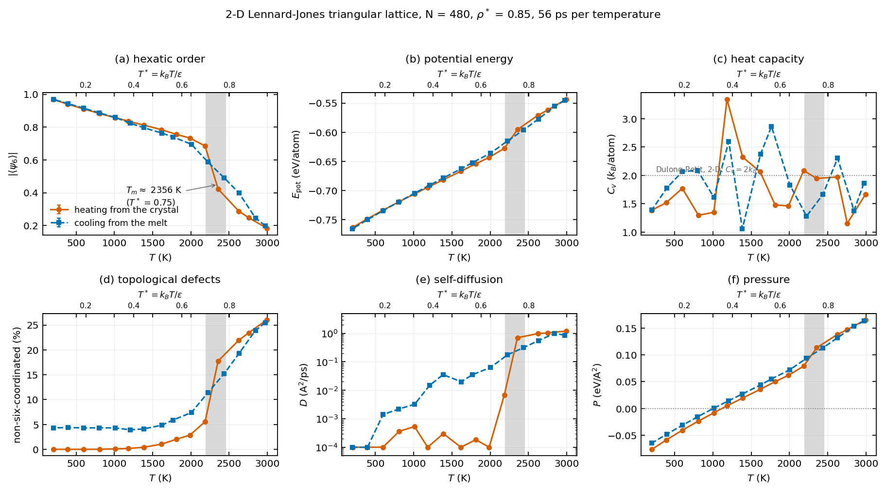

# trilattice

2-D molecular dynamics of Lennard-Jones crystals — simulate, watch, and measure the melting of a 2-D lattice in real time. Four lattice types, switchable while the simulation runs.



## Install

```bash
git clone <this repo> && cd trilattice
pip install -e ".[dev,fast]"      # fast = numba (5x speedup), dev = pytest
```

Requires Python ≥ 3.11, NumPy, SciPy, Matplotlib. Numba is optional.

## Quick start

```bash
trilattice init -o config.toml          # write a commented input deck
trilattice animate config.toml -T 600   # open the live dashboard
```

That's it — drag the temperature slider up and watch the crystal melt.

## Command line

| command | what it does |
|---|---|
| `trilattice init` | write a commented `config.toml` |
| `trilattice info config.toml` | derived quantities (density, timescales, sanity checks) |
| `trilattice run config.toml -T 300 -n 20000` | run one simulation, print statistics |
| `trilattice scan config.toml --t-min 200 --t-max 3000` | sweep temperature, print a table |
| `trilattice animate config.toml -T 600` | **interactive dashboard** (below) |
| `trilattice animate config.toml --minimal` | small keyboard-driven viewer |
| `trilattice bench` | throughput vs. system size |

Add `--xyz traj.xyz` to `run` to export a trajectory for OVITO/VMD, with per-atom hexatic order and coordination as extra columns.

## The dashboard

```bash
trilattice animate examples/config.toml -T 600
```

| control | effect |
|---|---|
| **lattice** selector | rebuild on another lattice without stopping the run (sits under the plots on the right) |
| **target T** slider | drives the thermostat, live |
| **rate** slider | simulation speed — down to slow motion (fractions of a step per frame), *never* changes the timestep |
| **time** slider | scrub back through the last 500 frames |
| `resume here` | restart the dynamics from the scrubbed frame, discarding the future |
| `quench` / `reheat` | relax to the nearest local minimum / redraw thermal velocities |
| `+vacancy` / `+interstitial` | inject a point defect into the running crystal |
| `reset` | back to the starting configuration |
| colour: `psi6` `coord` `speed` `energy` `displacement` | what the atoms are shaded by |
| overlays: bonds, trails, box | what is drawn |
| physics: thermostat, directional | what is simulated — NVE toggle, angular term on/off |
| analysis panel: `g(r)` `S(k)` `MSD` `speeds` `coordination` `T–ψ6` | live measurement, updating as you watch |

Headless machines get a compact recorder instead of a window:

```bash
trilattice animate config.toml -T 2800 --save melting.gif --frames 150
```

## Lattices



Pick the structure in the deck (`lattice = "square"`), on the command line (`--lattice kagome`), or from the dashboard while it runs — the cell counts are chosen automatically so the particle count stays roughly constant.

| lattice | neighbours | order parameter | ρa² | survives to |
|---|---|---|---|---|
| `triangular` | 6 | ψ₆ | 1.155 | melts ≈ 2400 K |
| `square` | 4 | ψ₄ | 1.000 | — |
| `honeycomb` | 3 | ψ₆ | 0.770 | ≈ 25 K |
| `kagome` | 4 | ψ₆ | 0.866 | ≈ 100 K |

**With a pair potential alone, only the triangular lattice is stable.** There is nothing to pay for bond angles, so close packing wins: it is the single ground state, and no starting configuration changes that. The other three collapse towards it when heated.

**Switch on directional bonding and they all hold.** A Stillinger–Weber-style three-body term charges for bond angles away from the ones each structure wants:

```bash
trilattice animate config.toml --lattice honeycomb --three-body 0.5
```

or tick **directional** in the dashboard's *physics* group (bottom right, under *overlays*) while it runs — untick it and watch the structure fall in. The physics switches are kept apart from the drawing overlays: `thermostat` and `directional` change what is being simulated, `bonds`/`trails`/`box` only change what is drawn.



Row 2 is the pair potential alone, row 3 the same runs with λ = 0.5 eV. After 5 ps at 300 K:

| lattice | z, pair only | z, with λ | \|ψₙ\| pair | \|ψₙ\| with λ |
|---|---:|---:|---:|---:|
| triangular | 6.00 | 6.00 | 0.951 | 0.997 |
| square | 5.39 | 4.00 | 0.007 | 0.994 |
| honeycomb | 5.08 | 3.00 | 0.403 | 0.966 |
| kagome | 5.36 | 4.00 | 0.436 | 0.993 |

The penalty is `[1 − cos(nθ)]/2`, which is zero at every multiple of 2π/n — and every bond angle of the target lattice is such a multiple (honeycomb 120°, square 90°/180°, triangular and kagome 60°/120°/180°). So the term costs **exactly zero** for the ideal crystal: it shifts no equilibrium property and can be toggled freely; it only makes departures expensive.

Note what this is: a per-structure parametrisation, not a universal potential. `n = 3` stabilises honeycomb and simultaneously penalises the triangular lattice, whose 60° angles sit at the maximum of that penalty. That is what a Stillinger–Weber potential is — the silicon one is fitted to the tetrahedral angle and does not describe close-packed silicon either. Pick `n` for the structure you mean to study.

The potential is identical for every lattice (ε, σ, r_c, dt, thermostat). What differs is the starting geometry and, with it, the density — at a fixed nearest-neighbour distance `a` the lattices sit at different ρ*, which is why the open ones break into close-packed islands separated by voids rather than into a uniform crystal:

| lattice | ρ* at a = 3.3567 Å |
|---|---:|
| triangular | 0.850 |
| square | 0.736 |
| kagome | 0.637 |
| honeycomb | 0.567 |

Each lattice carries its own diagnostics, because they do not transfer: ψ₆ is 1 on a triangular lattice and exactly 0 on a square one, and the ideal coordination differs. Both the order parameter and the coordination are tracked, since ψ₆ alone cannot tell kagome from triangular — it is 1 for both.

## Python API

```python
import trilattice as tl

config    = tl.build_lattice("triangular", nx=20, ny=12, a=3.2, mass=24.305)
potential = tl.LennardJones(epsilon=0.27, sigma=2.88, cutoff=8.0)
sim = tl.Simulation(config, potential, timestep=0.002,
                    thermostat=tl.Bussi(temperature=1500.0, tau=0.2), seed=1)
sim.set_temperature(1500.0)
sim.run(10000, log_every=0)          # equilibrate
sim.clear_log(); sim.reset_origin()
log = sim.run(40000, log_every=50)   # produce

from trilattice import observables as obs
spec = tl.lattice_spec("triangular")
print(obs.global_psi_n(sim.positions, sim.box, spec.cutoff(3.2), spec.psi_order))
print(obs.defect_fraction(sim.positions, sim.box, spec.coordination))
```

## What's measured



| quantity | function |
|---|---|
| bond-orientational order \|⟨ψₙ⟩\| | `observables.global_psi_n` |
| coordination defects | `observables.defect_fraction` |
| pair correlation g(r) | `observables.RDFAccumulator` |
| structure factor S(k) | `observables.structure_factor` |
| self-diffusion D | `observables.diffusion_coefficient` |
| Lindemann parameter | `observables.lindemann_2d` |
| pressure, heat capacity | `observables.pressure_2d`, `heat_capacity_nvt` |

## Package layout

| module | responsible for |
|---|---|
| `lattices.py` | the four lattice types and their symmetry metadata |
| `threebody.py` | the angular term that keeps open lattices open |
| `lattice.py` | periodic box, vacancies/interstitials, replication |
| `potentials.py` | the Lennard-Jones pair potential (three truncation schemes) |
| `neighbors.py` | O(N) neighbour search (cell list + Verlet list) |
| `forces.py` | force/energy evaluation (NumPy and Numba kernels) |
| `simulation.py` | the velocity-Verlet integrator and FIRE relaxation |
| `thermostats.py` | Berendsen, Bussi, Langevin, Nosé–Hoover |
| `observables.py` | every physical quantity listed above |
| `dashboard.py` / `animate.py` | the interactive viewers |
| `config.py` | reading/writing `config.toml` |
| `cli.py` | the `trilattice` command |

## Tests

```bash
pytest -q
```

The suite includes a layout check: `Dashboard.layout_conflicts()` measures the
**rendered** extent of every control and label — including the value text a
slider draws outside its own axes — and reports any pair that overlaps. Tests
run it across every rate setting, panel, colour mode, lattice and slider
extreme, so a future move that covers something fails instead of shipping.

```python
print(dashboard.layout_report())    # "layout OK: no overlapping controls"
```

## License

MIT.
